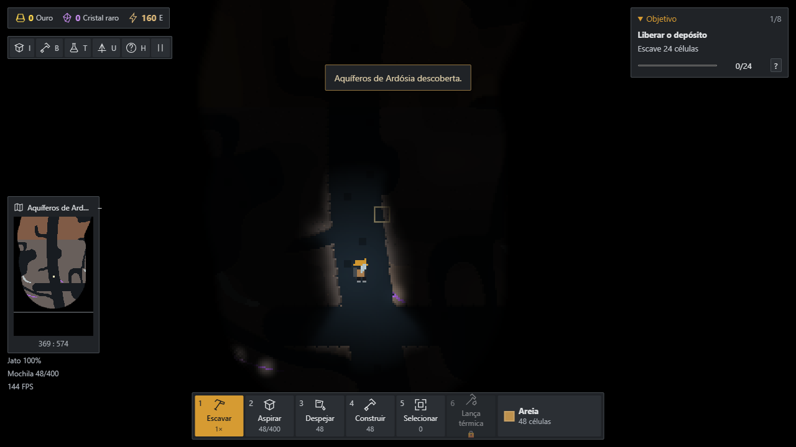

# Prismara

Jogo 2D de mineração e automação industrial em TypeScript, Vite e Canvas 2D. Escave depósitos consolidados, libere grãos físicos e molde a instalação com paredes, funis, comportas e esteiras. Misture areia com água finita, peneire a areia úmida e conduza o ouro até um coletor. O ouro financia pesquisa; cristais raros financiam melhorias especiais.

Código: [GustavoL266/Prismara](https://github.com/GustavoL266/Prismara). Arte em pixel, mapas por semente, tecnologias e efeitos sonoros procedurais próprios.



Capturas nas duas resoluções, resultados da fábrica autônoma e medições estão em [Validação](docs/validation.md).

## Executar e verificar

Requer Node.js 22 ou superior e npm.

```sh
npm ci
npm run dev
npm test
npm run build
npm run test:browser
npm run benchmark
npm run audit:terrain
```

O navegador não precisa de servidor de contas. O teste de navegador inicia o Vite se necessário; no Windows utiliza Chrome instalado. Em outros sistemas, instale Chromium com `npx playwright install chromium`. `CHROME_PATH` e `PRISMARA_TEST_URL` permitem configurar o navegador e o servidor. A suíte leva vários minutos, incluindo **três minutos reais**, sem intervenção, de uma instalação autônoma.

## Primeira fábrica

1. A mochila começa com **48 areia de construção**. **1** rompe depósitos e deixa os grãos no mundo. O personagem atravessa partículas soltas; terreno consolidado e estruturas continuam bloqueando.
2. **2 — Manipular** mostra um quadrado de **5 × 5 células**. Pressione para pegar uma porção de um único material, mova o cursor e solte para depositar. Líquidos, terreno e gases não são coletados. A ferramenta respeita alcance, paredes e descoberta. Use o propulsor para alcançar o lado aberto dos reservatórios.
3. Leve areia solta à água do bolsão à direita. Cada água consumida umedece um grão. Pegue a **areia úmida** com o mesmo manipulador e solte sobre a peneira. Construa um coletor abaixo e uma esteira na lateral; mantenha saídas livres.
4. O resíduo segue sobre a grelha e o ouro cai. O coletor converte cada grão valioso em uma moeda exatamente uma vez. A primeira cadeia dispensa aspirador e energia.
5. Por **6 ouro**, **Rotor de Coleta** desbloqueia o aspirador contínuo da tecla **7**. O manipulador permanece disponível. Alternativamente, Hidráulica custa 6 ouro e libera bomba, tubos e válvula.
6. **G** guarda explicitamente a carga manual na mochila, até a capacidade livre. **3** despeja o estoque escolhido em **I**. A carga nunca entra automaticamente no estoque. Se uma soltura for bloqueada ou parcial, os pixels restantes ficam na ferramenta, inclusive ao trocar de ferramenta, pausar e salvar.
7. Para produção contínua, alinhe módulos de esteira e peneira pela superfície interna de transporte. Umedeça a areia na correia, antes da grelha. Tubos conectam faces de módulos de 8 células; a bomba recebe líquido na face marcada e a válvula o devolve ao mundo. Desníveis exigem contenção para evitar derramamento.
8. A Sonda Escavadora alcança **48 células** além da face de trabalho. A instalação avançada usa uma bandeja de triagem para manter vidro fundido junto ao jato de névoa e deixar passar os produtos sólidos. Deixe um módulo de espaço entre a saída do cadinho e a bandeja, com a boca de névoa acima do acúmulo. As saídas de pelotas e água precisam de caminhos separados.

Alimentação pelo inspetor é uma conveniência limitada a **16 unidades**, exige proximidade do explorador e usa células físicas livres. Uma fábrica alimentada por gravidade, correias e hidráulica continua produzindo sem repetir essa ação.

## Controles

A interface e o despachante de teclado usam o mesmo catálogo em [src/game/input.ts](src/game/input.ts). A tabela abaixo é gerada com `npm run docs:controls`.

<!-- controls:start -->
| Controle | Ação |
| --- | --- |
| A / D / ← → | Andar |
| Espaço / W / ↑ | Propulsor |
| 1 | Escavar e liberar grãos |
| 2 | Manipulador manual: pressionar, mover e soltar |
| 3 | Despejar material |
| 4 | Construir por arraste |
| 5 | Selecionar conjunto em área |
| 7 | Aspirador contínuo (pesquisa) |
| G | Guardar carga manual na mochila |
| 6 | Lança térmica (pesquisa) |
| B | Catálogo de construção |
| T | Pesquisa |
| U | Melhorias |
| I | Inventário |
| H | Ajuda |
| M | Mapa geral (arraste e roda no painel) |
| N | Recolher minimapa |
| R | Girar o módulo e suas portas |
| Q | Material ou peça anterior |
| E | Próximo material ou peça |
| C | Copiar conjunto e configurações |
| V | Construir conjunto copiado |
| Delete | Recolher seleção |
| F | Câmera segue explorador |
| Esc | Pausa / fechar painel |
| Mouse esquerdo | Usar ferramenta / construir |
| Mouse direito | Recolher peça |
| Shift + mouse direito | Prévia e remoção em área |
| Shift + aspirar | Aspirar apenas o material selecionado |
| Roda do mouse | Zoom nítido |
| Mouse central + arraste | Mover câmera |
<!-- controls:end -->

## Construção e interface

Recursos no canto superior esquerdo, atalhos compactos, objetivo recolhível no canto superior direito, slots numerados na base e inspetor aberto somente para a máquina selecionada. **N** recolhe o minimapa; **M** alterna o mapa ampliado. A pausa oferece escala de interface de 85% a 140%.

Todas as peças ocupam **8 × 8 células**, equivalentes a **24 × 24 pixels no zoom padrão 3×**. A caixa de construção é quadrada, mas esteiras, grelhas, elevadores, coletores, funis e plataformas têm vazios físicos. A construção por arraste encaixa módulos nessa grade. Peças longas são sequências de unidades.

O catálogo mostra categoria, custo e portas. **R** gira desenho, partes sólidas, canais, entradas e saídas juntos em quartos de volta. Bloco, tubo, luminária, coletor e cofre têm orientação fixa. A prévia usa a mesma transformação do processamento. Cada segmento hidráulico continua comportando 48 células; redes desconectadas preservam conteúdos separados.

Arraste para construir continuamente. **5 + arraste** seleciona conjuntos; **C** copia as configurações; **V** constrói uma cópia pagando o custo. **Shift + botão direito + arraste** mostra uma prévia da remoção e aplica ao soltar. Recolher devolve o custo sem duplicar os grãos. Tubos só podem ser removidos quando existe espaço para devolver todo seu conteúdo ao mundo.

## Receitas

| Entrada e condição | Saída física |
| --- | --- |
| 1 areia + 1 água em contato | 1 areia úmida; água consumida |
| 1 areia úmida na peneira | 1 resíduo sobre a grelha + 25% de chance de 1 ouro abaixo |
| Ouro ou cristal no coletor | Uma moeda do respectivo tipo; grão removido |
| Resíduo ou polpa antiga no tambor | 1 argila lateral + 22% de chance de quartzo inferior |
| Argila no forno | Pelota cerâmica lateral |
| Pelota com queda ≥ 18 células sobre a prensa | 32 E + caco lateral |
| Quartzo + 3 E no cadinho | Vidro fundido inferior, a 1100 °C |
| Vidro fundido + névoa fria | 65% cristal raro / 35% fragmento; névoa vira água |
| Água + 0,35 E no gerador | Névoa fria na direção configurada |
| Resíduo aquecido a 420 °C | Resíduo calcinado |
| Resíduo + 0,6 E na câmara | Resíduo calcinado lateral, a 480 °C |
| Calcinado + 0,2 E no triturador | 70% argila / 30% quartzo inferior |
| Caco ou fragmento + 0,2 E no triturador | Areia; fragmentos têm 18% de chance de quartzo |
| Água > 100 °C | Vapor ascendente |
| Vapor frio ou contato com superfície fria | Água |
| Gelo aquecido acima de 0 °C | Água |

**Rendimento abstrato:** os bônus de ouro e quartzo representam concentração mineral por unidade processada e podem criar um subproduto adicional. Não há conservação estrita do número de pixels nessas receitas. Água é finita e consumida no umedecimento. Probabilidades variam em lotes pequenos; parâmetros ficam em [reactions.ts](src/sim/reactions.ts).

Máquinas reservam capacidade de saída antes de consumir entrada e energia. Material derramado permanece no mundo. Esteiras movem a camada em contato; pilhas e saídas cheias congestionam a instalação. Lançadores percorrem as células intermediárias e colidem com obstáculos. Grelhas bloqueiam o explorador e os rejeitos, mas permitem os materiais definidos por sua política de passagem.

## Pesquisa

| Ramo | Pesquisa | Custo | Dependências |
| --- | --- | --- | --- |
| Processamento | Tambor dos Sedimentos | 12 ouro | Fundamentos |
| Transporte | Impulso e Triagem | 8 ouro | Fundamentos |
| Gestão de líquidos | Hidráulica de Bolsões | 6 ouro | Fundamentos |
| Ferramentas | Rotor de Coleta | 6 ouro | Fundamentos |
| Ferramentas | Mandíbula de Campo | 6 ouro | Fundamentos |
| Energia e calor | Ciclo da Cerâmica | 14 ouro | Tambor |
| Processamento | Têmpera de Facetas | 18 ouro | Cerâmica + Hidráulica |
| Automação | Cadência Autônoma | 24 ouro | Transporte + Cerâmica |
| Exploração | Cartografia dos Estratos | 10 ouro | Mandíbula |
| Ferramentas | Lança Térmica | 16 ouro | Cerâmica + Mandíbula |
| Ferramentas | Mochila de Facetas | 10 ouro + 3 cristais | Vidro + Mandíbula |
| Exploração | Jato de Profundidade | 8 ouro + 4 cristais | Cartografia + Vidro |

Nenhum ramo básico exige cristais. A fonte inicial de ouro está disponível sem pesquisa ou energia. Melhorias ampliam alcance, capacidade, força de escavação e propulsão.

## Mundo e objetivos

Novas partidas usam **1024 × 1536 células**. O gerador primeiro deforma a superfície e as fronteiras das seis regiões; depois distribui salas com rejeição espacial que considera seu tamanho, constrói uma árvore de conexões com atalhos, escava túneis curvos de largura variável, refina o contorno e só então insere ruínas, veios e água. As famílias incluem galerias largas, salões altos, arcos, cavidades inclinadas, lobos, pilares, bacias e bolsões isolados intencionais.

Planície Âmbar, Galerias do Sedimento, Aquíferos de Ardósia, Estratos de Geada, Fendas Incandescentes e Arquivo das Profundezas possuem limites laterais irregulares. O minério aparece em veios de espessura variável e a água ocupa depressões verificadas pelas mesmas regras diagonais da simulação. Uma máscara de **5 × 9 células**, com a mesma regra de colisão do jogador, atravessando todos os grãos soltos, comprova que o corpo do explorador atravessa toda a rede principal. Os principais parâmetros ficam em [terrain-data.ts](src/sim/terrain-data.ts); `npm run audit:terrain` executa 30 sementes e produz mapas de diagnóstico em seis camadas.

Na superfície, a paisagem fornecida fica atrás do mundo e é recortada coluna a coluna pelo perfil real de `surfaceAt`. Ela usa escala equivalente a `cover`, sem deformação, e paralaxe horizontal de **0,035**; esse valor, a margem e o asset podem ser trocados em [assets.ts](src/render/assets.ts). Quando o limite do terreno sai pelo topo da câmera, a imagem nem sequer é desenhada. O subterrâneo continua usando exclusivamente `world.backdrop`, iluminação e descoberta.

O céu, o perfil externo e três células abaixo dele começam descobertos em toda a largura, coluna por coluna, sem propagar a descoberta pelas cavernas conectadas. Ao carregar, essa faixa se une à memória existente. O personagem registra permanentemente um **disco de 80 células** ao se mover. O desconhecido fica preto opaco na cena e nos mapas. Zoom, câmera e resolução não aumentam a descoberta. O minimapa acompanha o entorno; **M** abre o mapa geral, navegável por arraste e roda. O mapa guarda a última matéria observada: alterações distantes aparecem ao retornar.

A luz do capacete tem alcance de 65 células na superfície e 45 nas profundezas, com atenuação ao atravessar terreno. **Cartografia dos Estratos** desbloqueia a **Luminária de Galeria**: custa 3 areia, consome 0,002 E por passo, revela 38 células e ilumina 42. Desligar ou remover elimina a luz e conserva a descoberta. Emissão de cristais conhecidos e vidro quente ilumina uma área pequena; não descobre o mapa. O [contrato de exploração](docs/EXPLORACAO.md) explica as três camadas.

Três arquivos contêm desafios distribuídos: drenar uma câmara, derreter uma barreira e conduzir 12 pelotas a um mecanismo. Descubra seis regiões, resolva os três arquivos e pesquise Cartografia para conectar a rede no painel de pesquisa. A conclusão permite continuar explorando e expandindo a fábrica.

## Salvamento e compatibilidade

Formato **v5**, compatível com **v1–v4**. IDs de materiais e o mundo gerado são preservados: nenhuma migração regenera cavernas. O arquivo contém a carga manual com posições relativas, temperatura, queda, velocidades e variante visual, a pesquisa do aspirador, módulos e peças pendentes.

Partidas anteriores recebem acesso ao aspirador. Peças compridas são divididas em módulos; configurações e líquidos internos são preservados sem duplicação. O valor de construção original é distribuído entre as partes, para que removê-las não crie estoque extra. Conversões sem espaço ficam em **Inventário → Módulos aguardando reposicionamento**, sem custo para recolocar. Grãos que estavam fisicamente no mundo continuam nas mesmas células; não são absorvidos pela migração. O arquivo anterior validado é guardado no mesmo IndexedDB e pode ser exportado na pausa por **Exportar cópia anterior à migração**.

O salvamento usa **IndexedDB assíncrono**, com leitura de `prismara.world.v1` no localStorage para migração. Preserva células, consolidação dos depósitos, temperatura, queda, velocidades dos lançamentos, atividade dos chunks, estado aleatório, pesquisa, desafios, explorador, preferências, moedas e buffers de cada tubo. Não avança a simulação ao carregar. Filas de despejo são canceladas; material ainda na mochila permanece nela.

Também preserva máscara de descoberta, matéria cartográfica lembrada, pontos de interesse, posição/zoom do mapa, variantes visuais dos grãos e parede de fundo subterrânea. Variantes acompanham os grãos em trocas e conversões sem consumir o estado aleatório da física.

Salvamento automático a cada 25 segundos de simulação, ao pegar ou soltar uma carga manual, ao ocultar a aba e ao sair. Fechar o processo imediatamente pode interromper uma gravação assíncrona; use **Salvar** ou exporte antes. Exportação/importação usa arquivos `.prismara` com validação de limites, IDs, sobreposições, dependências e cartografia. O armazenamento pertence ao navegador e ao endereço da instalação.

## Arquitetura e desempenho

A simulação permanece separada do desenho e usa passo fixo de **30 Hz**. TypedArrays armazenam a grade; chunks de 16 × 16 dormem após estabilizar e acordam ao perder suporte. Depósitos consolidados não sofrem gravidade até serem escavados.

A máscara de colisão muda somente com construções, orientação, filtros e comportas. Redes de tubos são reconstruídas ao mudar peças. O desenho atualiza apenas chunks visíveis alterados, recorta máquinas fora da câmera e reutiliza um conjunto fixo de 320 efeitos. Não faz varredura global de luz por quadro. Coordenadas da câmera são alinhadas aos pixels; o acompanhamento pausa durante arraste para estabilizar a construção.

Medições, ambiente e limitações ficam em [docs/validation.md](docs/validation.md). `npm run benchmark` mede 5.400 ticks em mundos de tamanho completo. A suíte no Chrome registra FPS, tempo de simulação/renderização e operação autônoma. Relatórios, capturas e saves de teste ficam em `.local/`, ignorada pelo Git.

## Publicação

[.github/workflows/pages.yml](.github/workflows/pages.yml) instala dependências, executa testes de simulação e navegador e gera o build com **/Prismara/**. Apenas a branch principal publica o artefato estático no GitHub Pages. A existência do workflow não comprova publicação; consulte o ambiente `github-pages` após a execução.

## Limites práticos

A física é discreta e estilizada; não simula pressão hidráulica ou termodinâmica contínua. A energia usa uma bateria compartilhada. O mundo é finito, a pesquisa tem um conjunto definido de tecnologias e os desafios são gerados por regras de semente. As medições usam um desktop Ryzen 7 e Chrome headless; não garantem desempenho em computadores mais lentos ou instalações de milhares de máquinas. A campanha completa ainda não passou por estudo de balanceamento com jogadores; o teste por controles normais comprova a primeira cadeia, desbloqueio do aspirador, construção modular e deslocamento subterrâneo.

Não há multiplayer, contas, sincronização em nuvem ou controles por toque.
