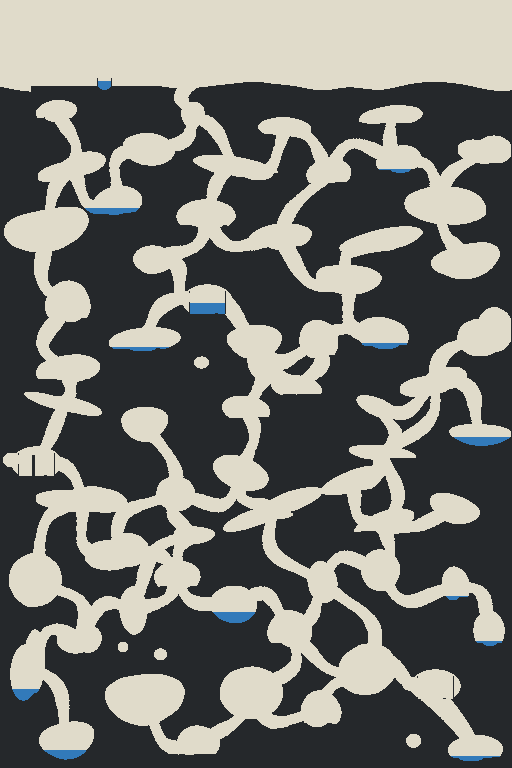
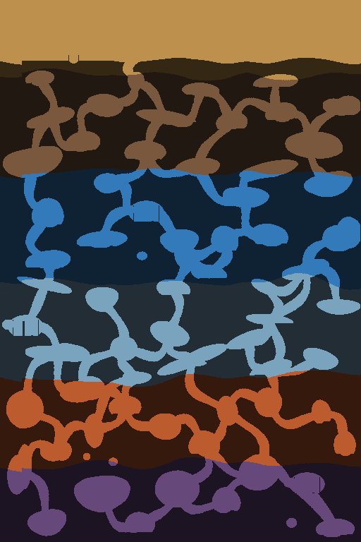

# Validação de Prismara 0.4

Execução local concluída em 2026-09-21. Os resultados abaixo pertencem ao código desta versão e à semente 91207 quando uma semente específica é necessária.

## Verificações executadas

- `npm ci`: 98 pacotes instalados e nenhuma vulnerabilidade reportada.
- `npm test`: **128 testes aprovados**, nenhum removido. A suíte anterior foi preservada e recebeu 39 cenários de geração, persistência e escala.
- `npm run build -- --base=/Prismara/`: TypeScript aprovado; 32 módulos transformados; JavaScript principal de 149,91 kB e asset de superfície de 1.048,00 kB.
- `npm run test:browser`: fluxo integral aprovado no Chrome 153.0.8010.48, sem erros JavaScript ou de console.
- `npm run benchmark`: 5.400 passos em cada cenário de 1024 × 1536.
- `npm run audit:terrain`: 30 sementes e cinco conjuntos de mapas de diagnóstico.

A suíte continua cobrindo mistura com consumo de água, saídas da peneira, crédito único no coletor, saída bloqueada sem perda, rotação, lançamento com colisão, contenção e vazamento, construção/remoção sem duplicação, pesquisa sem ciclos, migração e determinismo depois de carregar.

## Geração subterrânea

O gerador usa fluxos aleatórios independentes para superfície, cavernas, túneis, geologia, minério, água e ruínas. A ordem é: superfície e limites irregulares; rejeição espacial das salas; grafo conectado com atalhos; túneis curvos de largura variável; deformação e duas passagens de contorno; bolsões isolados; ruínas; veios; reservatórios; validação do corpo do explorador.

A rede principal usa árvore de custo espacial e conexões extras. Cada túnel é amostrado a cada três células, recebe curvatura suave e raio entre 9 e 14. As salas misturam sete famílias e deformação em três escalas. Sedimentos alargam galerias; gelo privilegia espaços horizontais; a região quente produz volumes mais verticais. `drain`, `thaw` e `feed` são posicionadas pela semente dentro de suas faixas e armazenadas no save.

### Auditoria de 30 sementes

| Medida | Resultado | Limite aceito |
| --- | ---: | ---: |
| Tempo de geração | 260,454–414,883 ms; média 315,081 ms | até 1.500 ms |
| Salas totais | 61–72 | distribuição escalada pelo mapa |
| Faixas espaciais ocupadas | 20 de 20 em todas as sementes | pelo menos 18 |
| Maior concentração numa faixa | 6 salas | no máximo 10 |
| Componentes de ar/água | 5–6 | rede principal + bolsões intencionais |
| Células alcançáveis pelo corpo | 508.350–567.913 | todos os destinos principais |
| Areia disponível | 29.406–37.213 | mais de 2.000 |
| Água disponível | 6.843–12.358 | mais de 300 |
| TypedArrays do mundo | 33,018 MiB | registrado |
| Metadados do terreno | 232,084–262,979 KiB | registrado |

As proporções vazias das cinco regiões subterrâneas ficaram entre **24,854% e 43,696%**. Todas as câmaras principais passaram pela máscara de colisão de 5 × 9 células; um flood fill de ar isolado não é usado como prova de passagem. Todos os reservatórios naturais e o bolsão inicial passaram pela regra real de líquido, inclusive deslocamento diagonal. A câmara `drain` é tratada separadamente porque sua função é permitir drenagem.

Na versão anterior, o gerador escavava uma espinha perto de `width × 0,38` e levava as três câmaras a `width × 0,60`. Agora cada semente distribui 57–68 salas principais por toda a largura e profundidade, com 10–13 atalhos, limites geológicos laterais e objetivos em posições distintas. Os bolsões desconectados aparecem como componentes pequenos explícitos.

## Fundo da superfície

O asset [surface-landscape.png](../src/assets/surface-landscape.png) tem **1672 × 941** e mantém proporção 1,776833. Uma única instância é decodificada e reutilizada. O desenho usa escala de cobertura, sem esticar, e paralaxe horizontal de **0,035**, limitado a 48 px.

O recorte segue `surfaceAt(world, x)` em cada coluna visível. O teste amostrou **22 combinações**: superfície, solo, travessia, pouco abaixo, profundidade, retorno, deslocamento horizontal, quatro resoluções/proporções, quatro zooms e saves carregados na superfície e no subterrâneo. Resultado: **zero pixels vazios no céu e zero pixels da paisagem sob o perfil real**. Em profundidade, `drawn=false` e o custo registrado foi 0 ms; na matriz visual, o máximo observado foi 0,2 ms.

O asset não altera células, RNG, tick, personagem ou descoberta. `world.backdrop` permanece a única parede das cavernas e continua passando por iluminação e neblina. Não há fade vertical: o recorte geométrico acompanha diretamente o terreno, evitando céu residual em cavidades profundas. Asset, intensidade do paralaxe e margem ficam centralizados em `src/render/assets.ts`.

## Partida por controles normais

O ensaio usa menu, teclado, mouse, escavação, aspiração, despejo, catálogo e pesquisa. A primeira produção rentável obteve **7 ouro em 22,900 s de simulação**, com 34 unidades úmidas e 111 células liberadas. O ouro financiou Hidráulica, e o jogador construiu uma rede de 864 unidades de capacidade, copiou e removeu um conjunto sem duplicação, girou uma parede, exportou, recarregou e importou o save.

Depois, uma rota calculada sobre a máscara do corpo foi percorrida com A/D e propulsor reais. O caminho tinha **917 células** e 256 pontos de direção; chegou à câmara inundada em **44,831 s**, na posição aproximada x=394,6, y=622,4. A descoberta terminou com mais de 152 mil células, sem revelar o mapa inteiro. Foram registradas cenas nas profundidades 300, 450 e 600.

## Três minutos de automação

A instalação foi montada uma vez com depósito consolidado, água finita, sonda, esteiras, peneira, coletor, bomba, tubos e válvula. Nenhuma matéria-prima foi acrescentada e nenhum controle foi usado durante a medição.

| Tempo | Ouro | Células liberadas | Areia úmida processada |
| --- | ---: | ---: | ---: |
| 30 s | 11 | 45 | 32 |
| 60 s | 21 | 90 | 67 |
| 90 s | 31 | 135 | 101 |
| 120 s | 44 | 180 | 135 |
| 150 s | 52 | 225 | 172 |
| 180 s | 56 | 270 | 205 |

Duração real **180,006 s** e simulada **180,033 s**. A indústria avançada do cenário controlado produziu 202 pelotas, 44 impactos, 47 unidades fundidas e 15 cristais coletados.

## Desempenho

Ambiente: Windows 10.0.26200, Node 24.19.0, AMD Ryzen 7 5700X, 16 processadores lógicos e 15,928 GiB de RAM. Chrome headless, sem limitação artificial.

| Cenário | Média por tick | p95 | p99 | Máximo | Cartografia |
| --- | ---: | ---: | ---: | ---: | ---: |
| Mundo gerado | 0,230 ms | 0,341 ms | 0,437 ms | 37,610 ms | 3 MiB |
| Linha autônoma | 0,613 ms | 0,844 ms | 1,012 ms | 8,301 ms | 3 MiB |

Na execução real do navegador, as seis amostras ficaram em **143,553–144,030 FPS**, simulação em **0,893–0,971 ms** e desenho em **1,413–1,584 ms**. O heap final observado foi 87,302 MiB. FPS e tempos do jogo são médias móveis pontuais, não garantia para outras máquinas ou fábricas muito maiores.

## Capturas reais

Todas as cenas abaixo foram produzidas pelo jogo em 1280 × 720 e 1920 × 1080.

| Cena | 1280 × 720 | 1920 × 1080 |
| --- | --- | --- |
| Início e paisagem | [Imagem](images/14-fundo-superficie-1280.png) | [Imagem](images/14-fundo-superficie-1920.png) |
| Primeira fábrica | [Imagem](images/02-primeira-fabrica-1280.png) | [Imagem](images/02-primeira-fabrica-1920.png) |
| Fábrica em etapas | [Imagem](images/03-fabrica-etapas-1280.png) | [Imagem](images/03-fabrica-etapas-1920.png) |
| Pesquisa | [Imagem](images/05-pesquisa-1280.png) | [Imagem](images/05-pesquisa-1920.png) |
| Percurso em profundidade 300 | [Imagem](images/15-percurso-300-1280.png) | [Imagem](images/15-percurso-300-1920.png) |
| Percurso em profundidade 450 | [Imagem](images/15-percurso-450-1280.png) | [Imagem](images/15-percurso-450-1920.png) |
| Percurso em profundidade 600 | [Imagem](images/15-percurso-600-1280.png) | [Imagem](images/15-percurso-600-1920.png) |
| Subterrâneo sem paisagem | [Imagem](images/16-fundo-subterraneo-1280.png) | [Imagem](images/16-fundo-subterraneo-1920.png) |
| Linha autônoma | [Imagem](images/06-linha-autonoma-1280.png) | [Imagem](images/06-linha-autonoma-1920.png) |
| Indústria avançada | [Imagem](images/07-industria-avancada-1280.png) | [Imagem](images/07-industria-avancada-1920.png) |

Os mapas de diagnóstico das sementes 0, 1, 7, 91207 e 4294967295 ficam em [docs/images/terrain](images/terrain). Cada semente possui camadas binária, biomas, salas, conexões, recursos e reservatórios. A comparação visual anterior permanece em [docs/images/comparacao](images/comparacao).

## Limitações restantes

A física e a temperatura são discretas; a bateria industrial é compartilhada; oclusão de luz é aproximada; o mundo é finito. O refinamento remove microartefatos com duas passagens e pode conservar pequenas ilhas de uma célula fora da rede principal. A geração custa mais que a versão anterior porque distribui dezenas de salas e comprova passagem pelo corpo; esse custo ocorre ao criar a partida, não a cada quadro. A campanha completa ainda precisa de sessões de balanceamento com jogadores e não há controles por toque, multiplayer ou sincronização em nuvem.
