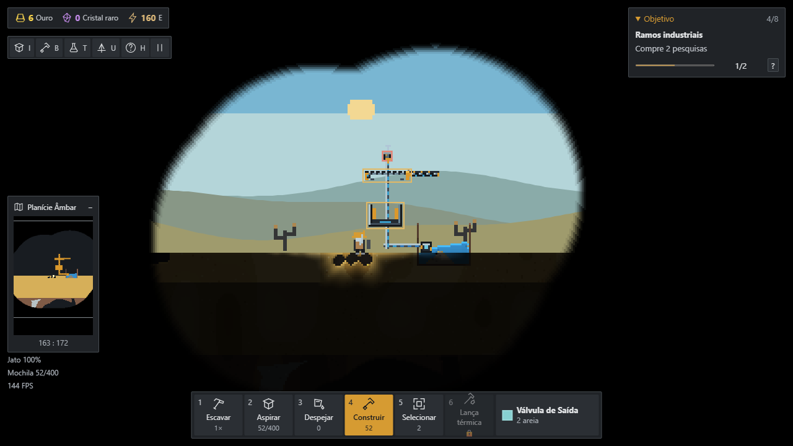

# Validação de Prismara 0.3

Execução local em 2026-09-17T23:56:52.565Z. Os parâmetros de arte, descoberta e luz são escolhas do projeto; os resultados abaixo vêm da execução desta versão.

## Comandos e cobertura

- npm ci: 98 pacotes, zero vulnerabilidades reportadas.
- npm test: 89 testes aprovados. Os 70 testes anteriores foram preservados; 19 verificam descoberta, memória, iluminação, migração, variantes e fronteiras de chunks.
- npm run build e npm run build -- --base=/Prismara/: TypeScript e builds de produção aprovados, incluindo worker assíncrono.
- npm run test:browser: 23 verificações aprovadas, zero erros JavaScript ou de console. Chrome 152.0.7977.84.
- npm run benchmark: 5.400 passos por cenário, em grades completas de 1024 × 1536.

Cobertura funcional: água finita consumida na mistura; ouro inferior e resíduo sobre a grelha; crédito único; saída bloqueada preservando entrada e energia; rotação/portas coerentes; lançamento percorrendo células intermediárias e colidindo; líquidos contidos e vazamento; construção/remoção sem sobrescrever grãos; save/load determinístico; pesquisas sem ciclos; migração v1/v2.

Cobertura de exploração: disco inicial exato; movimento fracionário e rápido; teleporte sem corredor; zoom, câmera, tela e mapa sem descoberta adicional; memória ao sair/retornar; fontes locais e remoção; nome de bioma sem revelar toda a região; overlays e inspetor ocultos; desconhecido preto opaco; dados cartográficos e variantes no save; novos mundos sem conhecimento herdado; fábricas desconhecidas continuam produzindo. A galeria compara estados desligado, operando e obstruído.

Verificação adicional de densidade de tela: contextos novos de Chrome com devicePixelRatio 1,5 e 2. Em ambos, viewport CSS 1280 × 720 e Canvas nativo 2560 × 1440. Construção de bloco pelo catálogo e mouse criou exatamente uma peça na célula apontada e cobrou uma areia. Câmera sobre área desconhecida retornou todos os pixels pretos com alpha 255, sem aumentar o conhecimento; zero erros JavaScript. Esse ensaio complementar fica fora da suíte principal de CI.

## Partida nova por controles normais

Semente 91207. O teste usa menu, A/D, propulsor, escavação, aspiração, inventário, despejo e catálogo. Não atribui materiais, inventário, pesquisas ou receitas para obter o primeiro ouro.

Primeira coleta rentável: **7 ouro em 21.333 segundos de simulação**, 34 unidades processadas e 111 células escavadas. A escavação não incrementa inventário; a aspiração separada recolhe grãos reais. Mistura é feita no bolsão natural e despejada pela ferramenta. Ouro paga Hidráulica. O teste constrói a rede de 864 unidades de capacidade, copia e recolhe um conjunto sem duplicação, gira uma parede, restaura IndexedDB e importa/exporta a partida. A interface cabe nas duas resoluções e em escala 1,4.

Depois, uma nova expedição atravessa a galeria usando movimento e propulsor até **x=369.400, y=624.118**. O mapa reúne esse trajeto; a máscara conserva 155.545 células conhecidas antes do teste de câmera. Não comprova toda a campanha por controles humanos.

## Três minutos de automação física

Instalação controlada montada uma única vez, com depósito consolidado de areia, água finita, Sonda, esteiras, peneira, coletor, bomba, tubos e válvula. Plataforma de observação e duas luminárias dão leitura à cena. Nenhuma matéria-prima é acrescentada e nenhum controle é usado durante a operação.

Duração real **180.008 s**, duração simulada **180.033 s**. Mina → transporte → umidificação → peneira → coleta. Ao final: **56 ouro**, 270 células liberadas e 205 unidades processadas; ainda há depósito remanescente.

| Tempo | Ouro coletado | Escavação automática | Processado |
| --- | ---: | ---: | ---: |
| 30 s | 11 | 45 | 32 |
| 60 s | 21 | 90 | 67 |
| 90 s | 31 | 135 | 101 |
| 120 s | 44 | 180 | 135 |
| 150 s | 52 | 225 | 172 |
| 180 s | 56 | 270 | 205 |

A instalação avançada recebe apenas os mesmos insumos crus na montagem. Em 5.400 passos produziu 202 pelotas, 44 impactos, 47 unidades fundidas e **15 cristais coletados**. Testa as receitas avançadas fisicamente; usa desbloqueios de cenário, não representa uma campanha avançada inteira por controles normais.

## Ambiente e desempenho

Windows win32 10.0.26200, Node v24.19.0, AMD Ryzen 7 5700X 8-Core Processor, 15.928 GiB de RAM, 16 processadores lógicos. Sem throttling artificial. A medida de Node inclui simulação e atualização de memória observada, sem desenho.

| Cenário Node | Média por tick | p95 | p99 | Máximo | TypedArrays do mundo | Cartografia |
| --- | ---: | ---: | ---: | ---: | ---: | ---: |
| generated | 0.355 ms | 0.444 ms | 0.680 ms | 31.889 ms | 33.018 MiB | 3.000 MiB |
| autonomous | 0.363 ms | 0.579 ms | 0.692 ms | 6.274 ms | 33.018 MiB | 3.000 MiB |

Geração: 186.352 ms. O máximo inclui inicialização/primeira varredura de chunks; percentis descrevem os 5.400 ticks, sem excluir esse custo. Atualização cartográfica com personagem parado: 0.007–0.007 ms/tick de média. RSS observado em Node: 93.914–113.422 MiB; inclui alocações transitórias e coleta de lixo.

Nos seis pontos da execução real: **80.270–144.022 FPS de requestAnimationFrame**, simulação **0.642–0.761 ms**, desenho **1.125–1.649 ms**. Atualização de descoberta naquele tick: 0.100–0.300 ms; último cálculo de luz: 1.500–2.000 ms. FPS/tempos de jogo são médias móveis pontuais, não percentis do período inteiro ou promessa de FPS em qualquer monitor. Heap JavaScript final observado: 82.438 MiB, incluindo transientes.

A revisão anterior mediu 0,312–0,324 ms/tick em Node e usava 30,018 MiB de TypedArrays. Esta acrescenta 3 MiB no mundo (fundo e variante) e 3 MiB de cartografia. A comparação de renderização anterior (0,147–0,195 ms) e atual inclui mudanças de cena, posição de observação, sprites e iluminação; não isola o custo de um único módulo.

## Capturas reais

Todas são renderizadas pelo jogo: **1280 × 720** e **1920 × 1080**. As cinco cenas centrais vêm de controles normais; a linha autônoma, os laboratórios, a galeria e o teleporte de teste são cenários controlados. Galerias e materiais estão em pausa para comparar estados; animação e produção contínua são exercitadas na instalação autônoma.

| Cena | 1280 × 720 | 1920 × 1080 |
| --- | --- | --- |
| Partida nova · controles normais | [Imagem](images/01-inicio-1280.png) | [Imagem](images/01-inicio-1920.png) |
| Primeira fábrica · controles normais | [Imagem](images/02-primeira-fabrica-1280.png) | [Imagem](images/02-primeira-fabrica-1920.png) |
| Hidráulica · controles normais | [Imagem](images/03-fabrica-etapas-1280.png) | [Imagem](images/03-fabrica-etapas-1920.png) |
| Exploração · controles normais | [Imagem](images/04-exploracao-1280.png) | [Imagem](images/04-exploracao-1920.png) |
| Pesquisa · controles normais | [Imagem](images/05-pesquisa-1280.png) | [Imagem](images/05-pesquisa-1920.png) |
| Linha autônoma · instalação controlada | [Imagem](images/06-linha-autonoma-1280.png) | [Imagem](images/06-linha-autonoma-1920.png) |
| Indústria avançada · instalação controlada | [Imagem](images/07-industria-avancada-1280.png) | [Imagem](images/07-industria-avancada-1920.png) |
| Percurso registrado · movimento normal | [Imagem](images/08-mapa-percurso-1280.png) | [Imagem](images/08-mapa-percurso-1920.png) |
| Luminária construída dentro do disco conhecido | [Imagem](images/09-luminarias-1280.png) | [Imagem](images/09-luminarias-1920.png) |
| Câmera sobre arquivo desconhecido · teste de ocultação | [Imagem](images/10-arquivo-desconhecido-1280.png) | [Imagem](images/10-arquivo-desconhecido-1920.png) |
| Arquivo após descoberta · teleporte explícito de teste | [Imagem](images/11-arquivo-descoberto-1280.png) | [Imagem](images/11-arquivo-descoberto-1920.png) |
| Galeria de transporte · 2× | [Imagem](images/12-galeria-transporte-1280.png) | [Imagem](images/12-galeria-transporte-1920.png) |
| Transporte · detalhe 3× | [Imagem](images/12-galeria-transporte-3x-1280.png) | [Imagem](images/12-galeria-transporte-3x-1920.png) |
| Transporte · detalhe 4× | [Imagem](images/12-galeria-transporte-4x-1280.png) | [Imagem](images/12-galeria-transporte-4x-1920.png) |
| Galeria de processamento · 2× | [Imagem](images/12-galeria-processamento-1280.png) | [Imagem](images/12-galeria-processamento-1920.png) |
| Galeria de estruturas e líquidos · 2× | [Imagem](images/12-galeria-estruturas-1280.png) | [Imagem](images/12-galeria-estruturas-1920.png) |
| Materiais · 2× | [Imagem](images/13-materiais-2x-1280.png) | [Imagem](images/13-materiais-2x-1920.png) |
| Materiais · 3× | [Imagem](images/13-materiais-3x-1280.png) | [Imagem](images/13-materiais-3x-1920.png) |
| Materiais · 4× | [Imagem](images/13-materiais-4x-1280.png) | [Imagem](images/13-materiais-4x-1920.png) |

Revisão visual: painéis compactos sem sobreposição nas resoluções exigidas; tipografia principal 14 px; personagem menor que a instalação; areia quente, água azul, ouro amarelo e cristais violetas; silhuetas próprias; tubos escolhendo conexões reais; fundo sem faixas extensas; grãos isolados mantêm cor, bordas somente no exterior da massa; nomes de regiões via descoberta; desconhecido recobre toda a cena. A distribuição de luz foi ajustada depois de capturas mostrarem equipamentos pouco legíveis entre fontes muito espaçadas.

## Comparação

| Cena | Antes | Depois |
| --- | --- | --- |
| Superfície | [Antes](images/comparacao/antes-superficie-1280.png) | [Depois](images/01-inicio-1280.png) |
| Primeira hidráulica | [Antes](images/comparacao/antes-fabrica-1280.png) | [Depois](images/03-fabrica-etapas-1280.png) |
| Exploração | [Antes](images/comparacao/antes-exploracao-1280.png) | [Depois](images/04-exploracao-1280.png) |

## Limites restantes

Física discreta e estilizada, bateria industrial compartilhada, oclusão de luz aproximada e mapa finito. O mapa guarda material observado, sem um histórico completo de estados das máquinas. Saves anteriores não possuem o caminho histórico; a migração revela entorno e construções. A primeira progressão é testada por controles normais; a campanha completa e o balanceamento de longo prazo precisam de sessões com jogadores. Desempenho em máquinas mais lentas, milhares de construções, multiplayer, nuvem e controles por toque não foram validados/adicionados.
