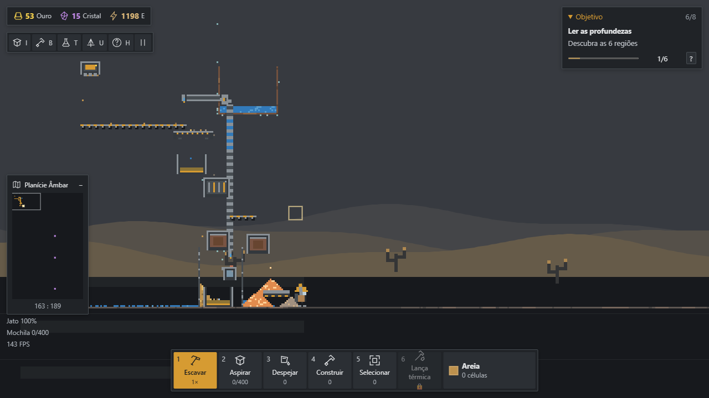

# Validação de Prismara 0.2

Validação executada em 17 de setembro de 2026. Os cenários abaixo distinguem a partida nova por controles normais das instalações controladas para testar operação prolongada.

## Comandos e cobertura

Todos passaram: `npm ci`, `npm test`, `npm run build` e `npm run test:browser`. São **70 testes** de simulação, além das verificações de navegador descritas abaixo. A instalação limpa encontrou zero vulnerabilidades; o build inclui o worker de salvamento.

A cobertura inclui consumo de água, ouro e resíduo em saídas distintas, crédito único, obstrução sem perda, rotação compartilhada com a prévia, colisão de lançamentos, contenção e vazamento, construção/remoção/carregamento sem duplicação, dependências acíclicas e migração v1. Também testa redes desconectadas, retomada determinística, aquecimento do gelo, comportas ocupadas e o mecanismo subterrâneo alimentado por doze pelotas. Sementes 1, 7 e 91207 têm galerias conectadas aos três arquivos.

## Partida nova por controles normais

Semente **91207**, mundo **1024 × 1536**. O roteiro inicia no menu e usa teclado, movimento, propulsor, mira, escavação, aspiração, despejo, catálogo e pesquisa. Nenhum material, moeda ou contador é atribuído artificialmente nessa etapa. Não utiliza alimentação pelo inspetor.

A primeira medição obteve **6 ouro**, com **35 unidades peneiradas**, após **21.50 segundos de simulação** desde o início. Lotes pequenos podem exigir mais uma mistura; o teste repõe material pelas mesmas ações e exige a coleta rentável em menos de três minutos.

O ouro financia Hidráulica; a construção conecta bomba, tubos e válvula a uma peneira. O teste seleciona, copia, paga e remove conjuntos, gira uma parede, confere o reembolso e restaura inventário/pesquisa/máquinas após salvar, recarregar, continuar, exportar e importar. Uma verificação adicional confirmou que importar um arquivo inválido mostra o motivo no menu inicial e preserva o mundo. A exploração por propulsor e caminhada alcançou **622.0 células** de profundidade. Não houve erros de JavaScript ou console.

## Três minutos sem intervenção

A instalação em [tests/fixtures/line.ts](../tests/fixtures/line.ts) é posicionada uma vez num mundo de tamanho completo. Sua única matéria-prima inicial é um depósito de 280 células de areia consolidada e água física num reservatório finito. A sonda libera grãos, quatro esteiras transportam, a válvula umedece, a peneira separa e o coletor credita. Durante a medição não há entrada artificial, alimentação por inspetor ou comando do jogador.

Duração real: **180.01 s**. Simulação: **180.00 s**, a 30 Hz. Ainda resta matéria-prima ao final.

| Tempo de simulação | Células mineradas | Unidades peneiradas | Ouro coletado |
| --- | --- | --- | --- |
| 30 s | 45 | 32 | 11 |
| 60 s | 90 | 67 | 21 |
| 90 s | 135 | 101 | 31 |
| 120 s | 180 | 135 | 44 |
| 150 s | 225 | 172 | 52 |
| 180 s | 270 | 205 | 56 |

Os testes conferem que cada água inicial permanece no mundo, num tubo ou foi consumida por um umedecimento, e que todo ouro emitido permanece físico ou creditado. O bônus de ouro é a abstração documentada de rendimento; resíduo não desaparece por isso.

## Indústria avançada

A instalação de [tests/fixtures/advanced.ts](../tests/fixtures/advanced.ts) recebe apenas areia e água. Em 5.400 ticks acelerados, produziu **205 argilas**, **202 pelotas**, **44 impactos**, **47 unidades de vidro fundido** e **15 cristais raros coletados**. Resíduo, cerâmica, energia, vidro e névoa dependem de saídas livres e transporte por gravidade. Pelotas permanecem sobre a prensa quando a bateria fica cheia. Esse cenário é separado da medição de três minutos reais.

## Ambiente e desempenho

Windows **win32 10.0.26200**, Node.js **v24.19.0**, **AMD Ryzen 7 5700X 8-Core Processor**, 16 processadores lógicos, **15.93 GiB de RAM**, Chrome headless **152.0.7977.84**. O benchmark de CPU roda fora do navegador, sem renderização, com 5.400 ticks por cenário; inclui os primeiros ticks e a estabilização inicial.

| Cenário 1024 × 1536 | Média por tick | p95 | p99 | Máximo | TypedArrays |
| --- | --- | --- | --- | --- | --- |
| Terreno gerado | 0.324 ms | 0.363 ms | 0.428 ms | 31.947 ms | 30.02 MiB |
| Fábrica autônoma | 0.312 ms | 0.342 ms | 0.428 ms | 4.739 ms | 30.02 MiB |

No cenário de navegador, os pontos medidos registraram **143.961–144.017 FPS** pela cadência de requestAnimationFrame, **0.508–0.545 ms** de simulação e **0.147–0.195 ms** de desenho. Esses tempos são médias suavizadas no ponto de leitura; não são percentis do teste inteiro. A cadência próxima de 144 Hz corresponde a este ambiente headless e não comprova a apresentação física de um monitor.

Heap JavaScript observado ao final: **71.33 MiB**. RSS do processo Node nos benchmarks: 96.52 MiB / 85.28 MiB. TypedArrays, heap e RSS têm escopos diferentes; não devem ser somados como se fossem medições independentes da memória total do navegador.

## Capturas e revisão visual

Capturas reais do Canvas e da interface, sem composição ou alteração de pixels. Foram revisados contraste, terreno consolidado versus grãos, escala do personagem, máquinas, saídas, legibilidade e sobreposição. A suíte verifica geometricamente os painéis em ambos os tamanhos e também o inspetor com escala de interface de 140%. A revisão corrigiu notificações que cobriam o texto do painel de pesquisa.

| Cena | 1280 × 720 | 1920 × 1080 |
| --- | --- | --- |
| Início · partida nova | [Imagem](images/01-inicio-1280.png) | [Imagem](images/01-inicio-1920.png) |
| Primeira fábrica · controles normais | [Imagem](images/02-primeira-fabrica-1280.png) | [Imagem](images/02-primeira-fabrica-1920.png) |
| Hidráulica · controles normais | [Imagem](images/03-fabrica-etapas-1280.png) | [Imagem](images/03-fabrica-etapas-1920.png) |
| Exploração · controles normais | [Imagem](images/04-exploracao-1280.png) | [Imagem](images/04-exploracao-1920.png) |
| Pesquisa · controles normais | [Imagem](images/05-pesquisa-1280.png) | [Imagem](images/05-pesquisa-1920.png) |
| Linha autônoma · instalação controlada | [Imagem](images/06-linha-autonoma-1280.png) | [Imagem](images/06-linha-autonoma-1920.png) |
| Indústria avançada · instalação controlada | [Imagem](images/07-industria-avancada-1280.png) | [Imagem](images/07-industria-avancada-1920.png) |

## Limites da evidência

O roteiro por teclado e mouse comprova a primeira cadeia, pesquisa hidráulica, construção e deslocamento subterrâneo. A instalação de três minutos é montada por fixture; a montagem avançada usa tempo acelerado. Nenhum desses testes equivale a um estudo de balanceamento de toda a campanha com jogadores.

A física é discreta e estilizada, sem pressão hidráulica ou termodinâmica contínua. Energia usa uma bateria compartilhada; mundo e recursos são finitos. As medições correspondem a este desktop e a instalações pequenas, sem garantir desempenho em milhares de máquinas ou computadores mais lentos. Fechar o processo imediatamente pode interromper uma gravação assíncrona; salvar/exportar explicitamente é a forma de guardar a última alteração.

Relatórios detalhados, logs, downloads de save e capturas temporárias ficam em `.local/`, fora do Git. Esta página e as imagens selecionadas documentam a validação; não incluem partidas pessoais ou credenciais.
